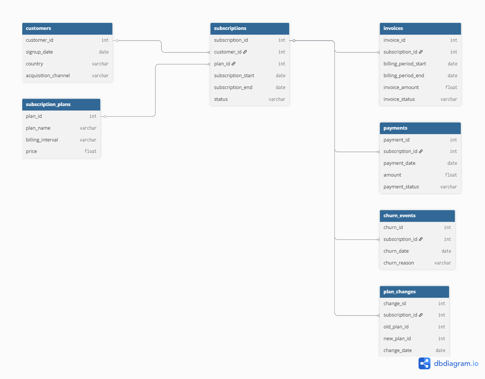
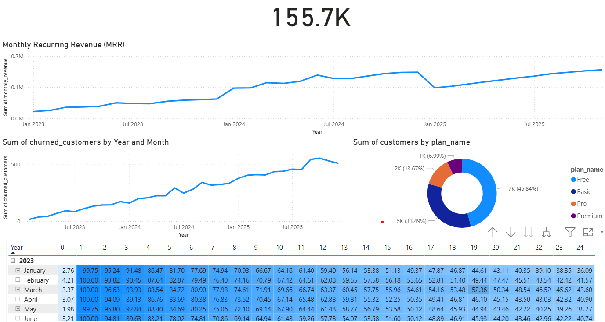

# SaaS Subscription Analytics Project

This project simulates a real SaaS (Software-as-a-Service) business environment and demonstrates how data analysts analyze subscription-based companies using modern data tools.

The project includes **synthetic SaaS subscription data**, SQL analytics, a Power BI dashboard, and exploratory analysis in Python.

The goal is to analyze key SaaS business metrics such as:

* Monthly Recurring Revenue (MRR)
* Customer churn
* Subscription distribution
* Customer retention
* Revenue trends

This project demonstrates a realistic analytics workflow from **data generation to business insights**.

---

# Project Architecture

The project follows a typical analytics pipeline:

Python → Data Generation
PostgreSQL → Data Storage
SQL → Business Metrics
Power BI → Visualization
Kaggle → Exploratory Data Analysis

This structure mirrors real-world data workflows used by SaaS companies.

---

# Dataset Overview

The dataset simulates a SaaS platform with multiple subscription tiers and customer lifecycle events.

It includes approximately **25,000 customers** and several related business tables.

Main dataset tables:

Customers
Subscriptions
Subscription Plans
Invoices
Payments
Churn Events
Plan Changes

These tables enable analysis of revenue, churn, customer retention, and subscription behavior.

---

# Database Schema

The dataset is structured as a relational database with multiple linked tables.

Customers create subscriptions, which generate invoices and payments. Subscriptions can churn or change plans over time.



Example relationship flow:
Customers → Subscriptions → Invoices
Subscriptions → Payments
Subscriptions → Churn Events
Subscriptions → Plan Changes

---


## Dataset

The synthetic SaaS dataset used in this project is publicly available on Kaggle.

Kaggle Dataset:
https://www.kaggle.com/datasets/ansarimuzammil/synthetic-saas-subscription-dataset


# Project Structure

```
saas-subscription-analytics
│
├── data
│   ├── raw
│   │   customers.csv
│   │   subscriptions.csv
│   │   payments.csv
│   │   subscription_plans.csv
│   │
│   └── processed
│       invoices.csv
│       churn_events.csv
│       plan_changes.csv
│
├── scripts
│   generate_saas_data.py
│
├── sql
│   01_mrr_calculation.sql
│   02_churn_rate.sql
│   03_cohort_retention.sql
│   04_plan_distribution.sql
│
├── dashboard
│   saas_powerbi_dashboard.pbix
│
├── notebooks
│   saas_analysis_kaggle.ipynb
│
├── docs
│   data_dictionary.md
│   database_schema.png
│   dashboard_preview.png
│
└── README.md
```

# Key Analytics Performed

## Monthly Recurring Revenue (MRR)

SQL queries calculate monthly recurring revenue using invoice data.
MRR is one of the most important SaaS growth metrics.

## Customer Churn

Customer churn events are tracked to analyze customer retention and identify churn patterns.

## Cohort Retention

Customers are grouped by signup month to analyze retention over time.

## Plan Distribution

Subscription plan popularity is analyzed to understand product adoption across pricing tiers.

---

# Power BI Dashboard

An interactive dashboard was built in Power BI to visualize SaaS performance metrics.

Key visualizations include:

Revenue growth over time
Customer churn trends
Subscription plan distribution
Customer cohort behavior



---

# Tools Used

Python
PostgreSQL
SQL
Power BI
Pandas
Matplotlib

---

# Use Cases

This dataset can be used for practicing SaaS analytics such as:

MRR analysis
Customer churn modeling
Cohort retention analysis
Customer lifetime value estimation
Subscription revenue forecasting

Because the dataset is synthetic, it can be shared publicly and used safely for analytics practice.

---

# Author

Muzammil Ansari
Data Analyst / Computer Science Student
